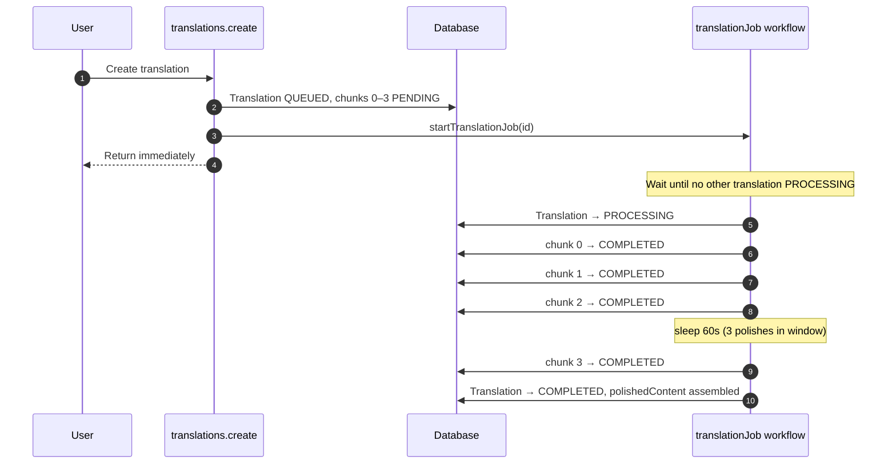
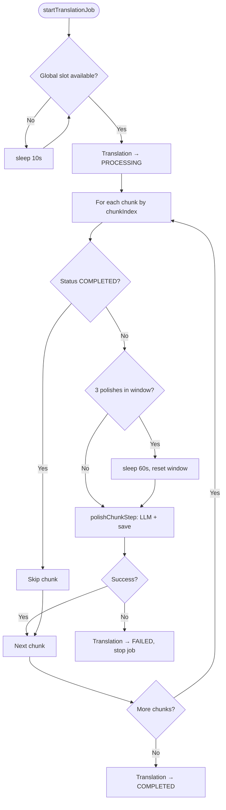
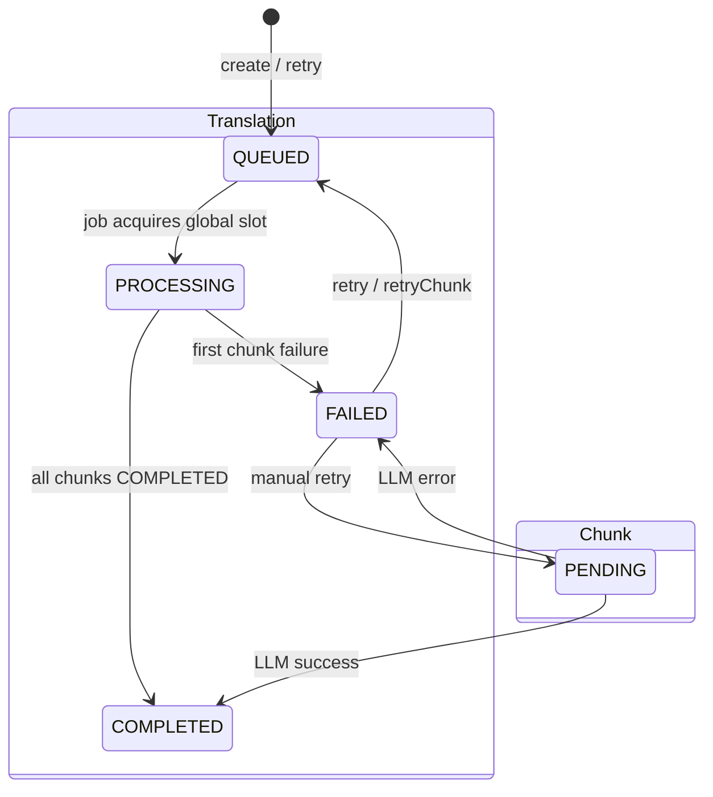

This is a [Next.js](https://nextjs.org) project bootstrapped with [`create-next-app`](https://nextjs.org/docs/app/api-reference/cli/create-next-app).

## Getting Started

First, run the development server:

```bash
npm run dev
# or
yarn dev
# or
pnpm dev
# or
bun dev
```

Open [http://localhost:3000](http://localhost:3000) with your browser to see the result.

You can start editing the page by modifying `app/page.tsx`. The page auto-updates as you edit the file.

This project uses [`next/font`](https://nextjs.org/docs/app/building-your-application/optimizing/fonts) to automatically optimize and load [Geist](https://vercel.com/font), a new font family for Vercel.

## Learn More

To learn more about Next.js, take a look at the following resources:

- [Next.js Documentation](https://nextjs.org/docs) - learn about Next.js features and API.
- [Learn Next.js](https://nextjs.org/learn) - an interactive Next.js tutorial.

You can check out [the Next.js GitHub repository](https://github.com/vercel/next.js) - your feedback and contributions are welcome!

## Deploy on Vercel

The easiest way to deploy your Next.js app is to use the [Vercel Platform](https://vercel.com/new?utm_medium=default-template&filter=next.js&utm_source=create-next-app&utm_campaign=create-next-app-readme) from the creators of Next.js.

Check out our [Next.js deployment documentation](https://nextjs.org/docs/app/building-your-application/deploying) for more details.

## Translation workflow jobs

Background chapter polishing runs through [Vercel Workflows](https://vercel.com/docs/workflows). **One durable job per translation** starts on create (and on retry); the job processes chunks sequentially by `chunkIndex`.

### Key files

| File | Role |
| --- | --- |
| `src/workflows/translation-job.ts` | Workflow definition and step functions |
| `src/lib/workflow/start-translation-job.ts` | Starts a job via `start()` from tRPC mutations |
| `next.config.ts` | Wrapped with `withWorkflow()` from `workflow/next` |
| `vercel.json` | Step route `maxDuration: 300` |

### Flow

1. **Create** — `translations.create` chunks the chapter (chunks `PENDING`, translation `QUEUED`), then `startTranslationJob` enqueues one workflow run.
2. **Wait for slot** — at most one translation is `PROCESSING` system-wide; other jobs sleep until the slot is free.
3. **Process** — job sets translation `PROCESSING`, polishes chunks in order (skipping `COMPLETED` on retry), applies overlap from the previous chunk's DB row.
4. **Rate limit** — after every 3 successful polish steps, the job sleeps 60 seconds before the next polish.
5. **Fail-fast** — first chunk failure marks the chunk `FAILED`, sets translation `FAILED`, and stops the job; remaining chunks stay `PENDING`.
6. **Finalize** — when all chunks are `COMPLETED`, assembled `polishedContent` is saved and status becomes `COMPLETED`.

### Diagram

End-to-end flow from create through completion (example: 4 chunks):



Job decision logic:



Status lifecycle:



| Trigger | Job started | Chunks reset |
| --- | --- | --- |
| **create** | Yes | All new → `PENDING` |
| **retry** | Yes | `FAILED` → `PENDING` |
| **retryChunk** | Yes | Target chunk → `PENDING` |

### Retry policy

Workflow steps do **not** auto-retry failed LLM calls. Chunk polish throws `FatalError` on LLM failure so the job stops immediately. Users retry manually from the UI.

Users retry from the chapter detail page (**Retry** / per-chunk **Retry**), which resets chunk(s) to `PENDING`, sets translation `QUEUED`, and starts a new job. Completed chunks are preserved and skipped.

`retryChunk` is rejected while that translation is already `PROCESSING`. Other translations may start jobs that wait for the global slot.

### Logs

Job steps log with prefix **`[translation-job]`** (`TRANSLATION_JOB_LOG_PREFIX` in `src/lib/workflow/log-prefix.ts`). Filter Vercel logs on that string, then trace a job by `translationId`.

| Message | Level | Source | Meaning |
| --- | --- | --- | --- |
| `job started` | log | `translation-job.ts` | Workflow run began |
| `mark processing` | log | `translation-job.ts` | Acquired global slot |
| `polish chunk started` | log | `translation-job.ts` | Step invoked for a chunk |
| `chunk not found` | warn | `translation-job.ts` | No DB row for `chunkId` |
| `chunk already completed` | log | `translation-job.ts` | Idempotent skip on retry |
| `processing chunk` | log | `translation-job.ts` | About to call LLM |
| `chunk completed` | log | `translation-job.ts` | Chunk saved; includes `tokenDelta` |
| `finalize translation` | log | `translation-job.ts` | All chunks done; assembling output |
| `translation completed` | log | `translation-job.ts` | Job finished successfully |
| `chunk failed` | error | `translation-job.ts` | LLM error; chunk marked `FAILED` |
| `translation failed` | log | `translation-job.ts` | Job stopped after chunk failure |

**Example:** find all log lines for one job:

```
[translation-job] translationId: "clx..."
```

In the Vercel dashboard: **Project → Observability → Workflows** for run history, or **Logs → Functions** and search `[translation-job]`.

### Debugging checklist

1. **Get `translationId`** from the UI or `Translation` table.
2. **Filter logs** by `[translation-job]` and that `translationId`.
3. **Follow the lifecycle** — `job started` → `mark processing` → `processing chunk` → `chunk completed` (repeat) → `finalize translation` → `translation completed`.
4. **If stuck on `QUEUED`** — another translation may hold the global slot; check for a row with `status = PROCESSING`.
5. **If `chunk failed`** — read `error` in the log and `Translation.errorMessage` in the DB; use **Retry** after fixing the underlying issue.
6. **If progress looks wrong** — check `TranslationChunk.status` per index; the job updates `progressPct` after each chunk.

### Local development

Workflow jobs require **`vercel dev`** or a **Vercel preview deployment** with `vercel link` and `vercel env pull`. Plain `next dev` does not execute durable workflow steps end-to-end. Optionally run `npx workflow web` to inspect local runs.

## Vietnamese correction provider (Modal)

The **Vietnamese Correction (Modal)** provider runs [bmd1905/vietnamese-correction-v2](https://huggingface.co/bmd1905/vietnamese-correction-v2) on [Modal](https://modal.com/) GPU workers. The Next.js app calls the deployed Modal HTTPS endpoint; inference does not run on Vercel.

### GitHub secrets

Add these repository secrets before running the deploy workflow:

| Secret | Purpose |
| --- | --- |
| `MODAL_TOKEN_ID` | Modal CI authentication |
| `MODAL_TOKEN_SECRET` | Modal CI authentication |
| `HF_TOKEN` | Hugging Face model download on Modal |
| `MODAL_VIETNAMESE_API_KEY` | Shared API key for Modal endpoint and Vercel app |

### Deploy workflow

Run **Deploy Vietnamese Correction to Modal** (`.github/workflows/deploy-modal-vietnamese-correction.yml`) from GitHub Actions. Each run:

1. Syncs `HF_TOKEN` → Modal secret `hf-token` (`--force`)
2. Syncs `MODAL_VIETNAMESE_API_KEY` → Modal secret `modal-vietnamese-api-key` (`--force`)
3. Runs `modal deploy modal/vietnamese_correction.py`

After deploy, copy the Modal HTTPS URL into Vercel (and local `.env`) as `MODAL_VIETNAMESE_API_URL`. Set the same `MODAL_VIETNAMESE_API_KEY` on Vercel.

### Typed API client

The Next.js app calls Modal through `src/lib/modal-vietnamese/` (`openapi-fetch` + generated types from `openapi/vietnamese-correction.openapi.json`). Regenerate types after the Modal API changes:

```bash
# Optional: refresh snapshot from deployed endpoint
curl -H "x-api-key: $MODAL_VIETNAMESE_API_KEY" \
  "$MODAL_VIETNAMESE_API_URL/openapi.json" \
  -o openapi/vietnamese-correction.openapi.json

pnpm generate:api
```

### Local Modal smoke test

```bash
pip install modal
modal run modal/vietnamese_correction.py --text "côn viec kin doanh thì rất kho khan"
```
