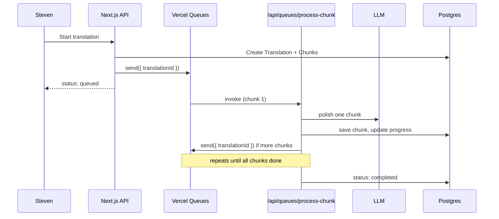

# Design: Reword Stories — MT Novel Polisher

Generated by /office-hours on 2026-06-18
Branch: main
Repo: reword-stories (greenfield)
Status: APPROVED
Mode: Builder

## Problem Statement

Steven loves reading novels from other countries but struggles to learn foreign languages. He finds translated versions online, but most are raw machine translation (Google Translate quality): awkward phrasing, lost context, hard to follow. He wants a web app that takes that ugly MT text and rewords it into smooth, readable prose he can actually enjoy.

V1 input: copy/paste raw chapter text. No URL scraping or EPUB import yet.

## What Makes This Cool

The magic moment is **opening a chapter that finally flows**. Not "I ran it through ChatGPT" — but sitting down with an immersive reader and forgetting the text was ever machine-translated. The project/translation/queue structure means Steven queues a chapter, walks away, comes back to polished prose waiting in a reader built for novels (not chat boxes).

## Constraints

- **Audience v1:** Steven only (personal side project)
- **Input v1:** Copy/paste raw MT text
- **Processing:** Long chapters need async background jobs with visible status
- **Models:** User picks provider per translation (DeepL, ChatGPT, Gemini, extensible)
- **Not v1:** Social sharing, URL/EPUB import, source-language translation
- **Greenfield:** No existing app code; OpenSpec scaffolding only

## Premises

1. **Post-edit, not translate:** Core job is polishing already-machine-translated target-language text (typically English), not translating from Korean/Chinese/Japanese from scratch. User tags source language on novel creation to improve prompt context.
2. **Paste-only v1:** No file upload, URL fetch, or EPUB parsing in first release.
3. **Async queue required:** Chapters processed in background with status tracking (queued → processing → completed/failed).
4. **Personal-use v1:** Single-user app; sharing polished translations with friends is 10x, not v1.
5. **Copyright awareness:** User processes content they have personal rights to read; app does not host or distribute copyrighted novels publicly in v1.

## Design Principles

- **Reader is the product.** The immersive reader is the emotional center; the pipeline is plumbing. Don't let project/translation hierarchy block the read path.
- **Post-edit, not translate.** The wedge is polishing already-MT text into readable prose — not another source→target translation app (OpenNovel, Lexilit territory).
- **Async by default.** Chunking + background queue are non-negotiable for novel-length text.
- **Model choice matters.** User picks provider per translation (DeepL, ChatGPT, Gemini).
- **Deferred to v1.5+:** MT peek toggle, edition stacks, inline re-polish, glossary consistency across chapters.

## Landscape Context

**Layer 1 (conventional wisdom):** Novel-length MT needs chunking, progress checkpoints, glossary consistency, resumable pipelines. Post-editing (MTPE) is a known workflow.

**Layer 2 (2026 landscape):** Crowded translation space — OpenNovel, Lexilit, NoveLA, ePubTsuyaku, Glossarion, LunaFrost all offer multi-model translation + reader + queue. Most assume source→target translation.

**Layer 3 (our wedge):** Steven's problem is target→better-target post-editing of already-MT text. Few tools productize "paste garbage MT, get readable prose, store for later" as a web reader. Differentiation: **stored polished editions + project structure + model choice**, not raw translation quality alone.

**EUREKA:** Everyone builds translators. Almost nobody builds a **reader for already-broken translations**. The product is a reading experience, not a translation API.

## Architecture

Next.js on Vercel + Postgres + Vercel Queues. Novel projects → paste raw content → translation jobs (model picker, status) → reader view.

Patterns borrowed from: ePubTsuyaku (chunk checkpoints), OpenNovel (project structure).

### Why serverless queues (not a separate worker)

Chapter polishing is chunked (~1800 tokens per LLM call). Each chunk is one short LLM request (typically 15–90s) — well under Vercel’s **300s (5 min) function limit** on Hobby.

| Work unit | Typical duration | Fits 5 min? |
|-----------|------------------|-------------|
| One chunk (one LLM call) | 15–90s | Yes |
| ~5k-word chapter (~4–5 chunks) in one function | 2–5 min | Yes, but tight |
| Max chapter (100k chars, ~15–25 chunks) in one function | 8–38 min | No |

**Rule:** one queue message processes **one chunk**, then enqueues the next pending chunk (or marks translation complete). No separate worker process or Redis required.

### Queue flow



### Tech Stack

| Layer | Choice | Why |
|-------|--------|-----|
| Framework | Next.js 15 (App Router) | Full-stack, API routes + React UI in one repo |
| Hosting | Vercel | Serverless functions + managed queue in one platform |
| Database | PostgreSQL + Prisma (`@prisma/adapter-pg`) | Relational fit for projects/translations/chapters; Docker Compose locally, hosted Postgres in prod |
| Queue | Vercel Queues (`@vercel/queue`) | Native push consumers, retries, visibility lease extension |
| UI | Tailwind CSS + shadcn/ui | Fast, accessible components |
| LLM adapters | Provider interface with DeepL, OpenAI, Gemini implementations | User picks model per translation |

### Data Model

```
Novel (project)
  ├── title
  ├── source_language (tag: ko | ja | zh | other)
  ├── created_at
  └── Chapters[]
        ├── title (optional)
        ├── raw_content (pasted MT text, max 100k chars)
        ├── sort_order
        └── Translations[]
              ├── provider (openai | gemini | deepl)
              ├── model_name (e.g. gpt-4o, gemini-2.0-flash)
              ├── status (queued | processing | completed | failed)
              ├── progress_pct (completed_chunks / total_chunks * 100)
              ├── error_message (nullable)
              ├── token_usage (nullable, for cost tracking)
              ├── polished_content (full chapter, assembled from chunks)
              └── TranslationChunks[]
                    ├── chunk_index
                    ├── raw_slice
                    ├── polished_slice
                    ├── status (pending | completed | failed)
                    └── token_count
```

**v1 input rule:** One paste = one chapter. No `---` delimiter splitting until v1.5.

**v1 access:** Middleware basic auth via `SITE_PASSWORD` env var. No signup UI.

### Core User Flows

**1. Create novel**
- User clicks "New Novel"
- Enters title, selects source language tag (dropdown: Korean, Japanese, Chinese, Other)
- Lands on novel detail page

**2. Add raw content**
- Paste MT text into textarea (one chapter per paste)
- Validate: non-empty, max 100k chars; reject with inline error if exceeded
- Save as Chapter with `sort_order`

**3. Create translation**
- Click "New Translation" on a chapter
- Pick provider + model from dropdown
- Show pre-flight estimate: "~N chunks, est. $X" (based on char count)
- Job enqueued → status badge shows Queued → Processing (with %)
- Client polls `GET /api/translations/:id` every 3s while status = processing
- On complete → Done; on failed → show `error_message` + Retry button

**4. Read**
- When translation status = completed, "Read" button opens reader view
- Reader: distraction-free, adjustable font/size, sepia/dark/light themes
- Chapter navigation within novel
- v1: polished text only. v1.5: toggle to peek original MT (deferred)

### Queue Pipeline

1. **Chunking (on enqueue):** When user starts a translation, API route splits chapter on `\n\n` paragraph boundaries using `gpt-tokenizer` (~1800 tokens max per chunk). If a single paragraph exceeds limit, split on sentence boundaries (`. `). Never mid-word. Persist `TranslationChunk` rows immediately (enables pre-flight “~N chunks” estimate).
2. **Kickoff:** API route sets translation `status = queued`, publishes one Vercel Queue message to topic `translation-chunk`: `{ translationId }`. Returns immediately.
3. **Consumer (`/api/queues/process-chunk`):** Push handler via `handleCallback` from `@vercel/queue`. `maxDuration = 300`. Load translation; find next chunk with `status = pending | failed`; skip if none pending (idempotent no-op).
4. **Prompt (post-edit):** System prompt includes source language tag (`other` → generic prompt without language hints). Instruct model to preserve meaning/plot/names while fixing awkward MT phrasing. Pass last paragraph of previous **completed** chunk as overlap context (max 500 tokens).
5. **Process one chunk:** Call provider adapter → save `polished_slice` + `token_count` → mark chunk `completed` → set translation `status = processing` → update `progress_pct`.
6. **Chain or finish:** If more pending chunks remain, `send('translation-chunk', { translationId })` for the next chunk. If all done, concatenate into `polished_content`, set `status = completed`.
7. **Resume:** Queue retries on handler throw; consumer skips `completed` chunks (idempotent). Stale `processing` translations can be re-kicked via retry endpoint.
8. **Retry:** Vercel Queues automatic retries with custom backoff on 429/5xx. Fail fast on 400/content-policy (acknowledge message). `POST /api/translations/:id/retry` resets failed chunks to `pending` and re-publishes kickoff message (same Translation row, not a new one).
9. **Bulk novel:** "Translate all chapters" creates one Translation per chapter and publishes one kickoff message each (not one parent job).

### API Routes (sketch)

- `POST /api/novels` — create novel
- `GET /api/novels` — list novels
- `GET /api/novels/:id` — novel detail + chapters
- `POST /api/novels/:id/chapters` — add chapter (paste)
- `POST /api/chapters/:id/translations` — create translation + chunks, publish queue kickoff
- `GET /api/translations/:id` — status + result (polled every 3s while processing)
- `POST /api/translations/:id/retry` — reset failed chunks, re-publish kickoff
- `POST /api/queues/process-chunk` — Vercel Queue consumer (not public; wired via `vercel.json` trigger)

### Pages

| Route | Purpose |
|-------|---------|
| `/` | Library — list of novels |
| `/novels/new` | Create novel form |
| `/novels/[id]` | Novel detail — chapters list, translation status per chapter |
| `/novels/[id]/chapters/new` | Paste raw MT content |
| `/novels/[id]/chapters/[chapterId]/translate` | Model picker + start translation |
| `/read/[translationId]` | Immersive reader |

### Provider Adapter Interface

```typescript
interface TranslationProvider {
  name: string;
  models: { id: string; label: string }[];
  polish(params: {
    text: string;
    sourceLanguage: string;
    contextOverlap?: string;
  }): Promise<string>;
}
```

Implementations:
- `OpenAIProvider` — v1 first; `polish()` via chat completion with post-edit system prompt
- `GeminiProvider` — v1.1; same `polish()` semantics
- `DeepLProvider` — v1.1; uses DeepL **Write** API for English polish (not Translate). If Write unavailable for target text, skip DeepL in v1

All behind one interface; per-provider semantics documented in adapter.

### Deployment

**Recommended v1:** Vercel project with:
- Next.js app (UI + API routes)
- Vercel Queues topic `translation-chunk` with push consumer on `/api/queues/process-chunk`
- PostgreSQL via Prisma — local dev uses Docker Compose (`pnpm docker:up`); production sets `DATABASE_URL` to any hosted Postgres instance

Flow: API route publishes to Vercel Queue → Vercel invokes consumer function → consumer updates Postgres → chains next chunk message if needed.

**Local database:** `docker/docker-compose.yml` runs `postgres:16-alpine` on `localhost:5432` with credentials in `.env.example`. Run `pnpm prisma migrate dev` locally; `vercel-build` runs `prisma migrate deploy` against production `DATABASE_URL`.

**`vercel.json` (sketch):**

```json
{
  "functions": {
    "app/api/queues/process-chunk/route.ts": {
      "maxDuration": 300,
      "experimentalTriggers": [
        { "type": "queue/v2beta", "topic": "translation-chunk" }
      ]
    }
  }
}
```

**Env vars:** `SITE_PASSWORD`, `OPENAI_API_KEY`, `GEMINI_API_KEY`, `DEEPL_API_KEY`, `DATABASE_URL`

**Queue config:** Consumer `visibilityTimeoutSeconds: 300` (SDK default; auto-extends while handler runs). Use `idempotencyKey: \`${translationId}-${chunkIndex}\`` when chaining to avoid duplicate chunk processing on retry.

## Open Questions

1. ~~**Chapter delimiters:**~~ **Resolved for v1:** One paste = one chapter.
2. **Cost controls:** Pre-flight estimate added; monthly cap TBD.
3. **Offline:** Does Steven need offline reading, or web-only is fine?
4. **Name consistency:** Glossary for character names across chapters — v1.5 (after basic loop works).

## Success Criteria

- [ ] Steven pastes a 5000-word MT chapter and gets readable prose without manual ChatGPT copy-paste
- [ ] Translation status visible while processing; can leave page and return
- [ ] Can create 2+ translations of same chapter with different models and compare (manual: open both readers)
- [ ] Reader feels like a novel app, not a chat interface
- [ ] Failed jobs show error and can be retried

## Distribution Plan

- **Deliverable:** Web application deployed to Vercel
- **Access v1:** Single-user, no public signup. Deploy behind simple password or localhost for Steven.
- **CI/CD:** GitHub Actions — lint, typecheck, test on PR; deploy to Vercel on merge to main
- **No app store, no package manager** — browser-only

## Next Steps

1. **Scaffold:** Next.js + Prisma + `@vercel/queue` + shadcn
2. **Schema:** Implement Novel, Chapter, Translation, TranslationChunk models
3. **Paste flow:** Create novel → add chapter → verify raw text saves
4. **One provider:** OpenAI adapter + post-edit prompt (prove quality before multi-model)
5. **Queue consumer:** Chunking on enqueue, one-chunk-per-message pipeline, progress updates
6. **Reader:** Distraction-free reading view with theme toggle
7. **Multi-model:** Add DeepL + Gemini adapters
8. **Polish:** Status badges, retry, library page

## What I noticed about how you think

- You named **Steven** specifically, not "users who read translated fiction." That's a real person with a real workflow, and it kept the scope honest.
- You optimized for the **full reader with projects and queue**, not the fastest possible ship — the product you'd actually want to use.
- You tagged **source language on novel creation** even though you're not translating from source. That's builder instinct: set up metadata now so prompts work better later, even if v1 doesn't need it.
- Your 10x is **sharing with friends**, not monetization or platform scale. This is a tool you'd be proud to show someone, not a startup pitch.

## The Assignment

Paste one real MT chapter Steven is currently struggling through (pick the worst one). Run it through ChatGPT manually with a post-edit prompt. Send Steven the before/after. If he says "I'd read the whole novel like this," you have demand signal. If he shrugs, tune the prompt before writing code.
